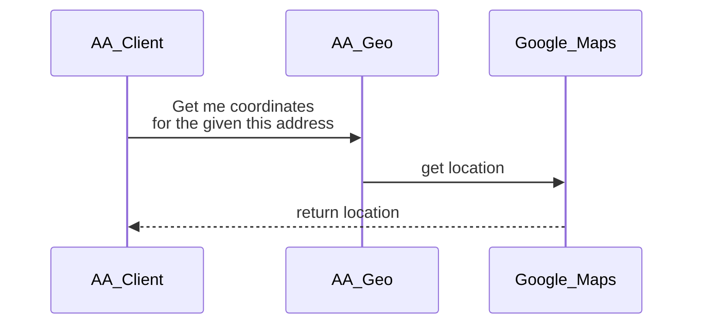

# getLatLong

A singular endpoint API to get coordinates from an address. Deployed as a kluster on GKE via Terraform

```mermaid
sequenceDiagram
    participant AA_Client
    participant AA_Geo
    participant Google_Maps
    AA_Client->>AA_Geo: Get me coordinates <br> for the given this address
    AA_Geo->>Google_Maps: get location
    Google_Maps-->>AA_Client: return location
```
